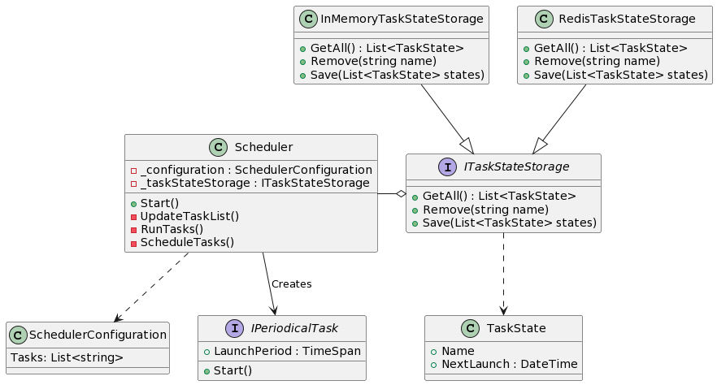

# Task scheduler

Небольшой планировщик заданий на C#. 

Список задач конфигурируется в файле appsettings.json, так же есть возможность динамически добавлять и удалять работающие задачи. Запускаемые задачи должны находиться в одной сборке с приложением.

